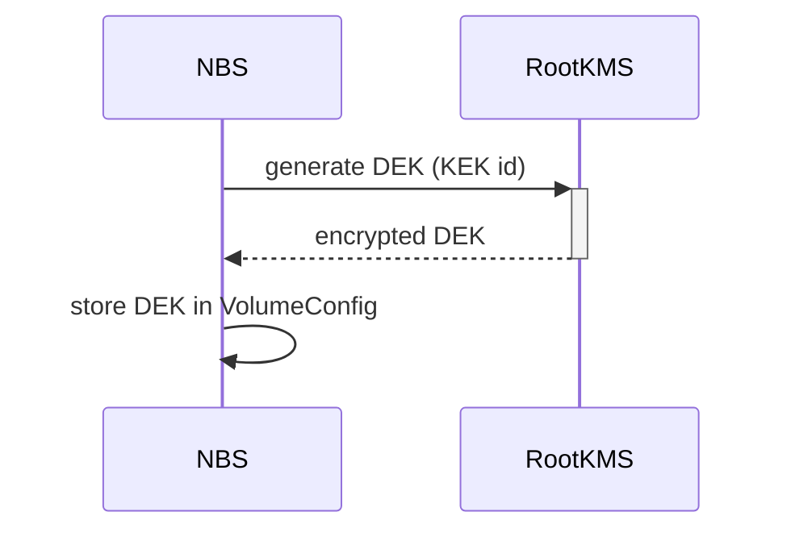
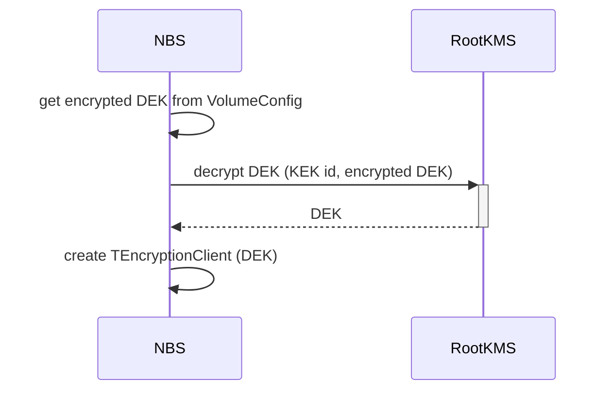

# Encryption at rest (NRD/Mirrored)

## General information
The data encryption key (DEK) is stored in encrypted form in the volume metadata ([EncryptionDesc](../../../contrib/ydb/core/protos/blockstore_config.proto#L117)). For DEKs generating and encrypting the root key management service (RootKMS) is used. A key encryption key (KEK) that uses for encryption and decryption of DEKs is stored in RootKMS and is not transmitted in open form - requests to RootKMS use only the identificator of the master key. If the master key is compromised, a new one is generated and then all DEKs must be re-encrypted (and updated in the volume metadata) using the new master key.

## Creating a volume
NBS requests a new DEK from RootKMS, sending the KEK identificator. The received encrypted DEK is stored in the volume metadata.

## Mounting a volume
NBS requests the decrypted DEK from RootKMS, sending the encrypted DEK and the KEK id. The received DEK is used for the encryption/decryption of IO requests data. To handle IO requests the [TEncryptionClient](../../../cloud/blockstore/libs/encryption/encryption_client.cpp#L138) is used.

